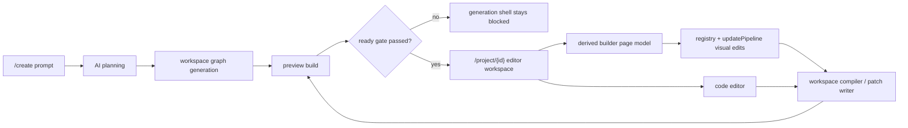

# Webu v2 Architecture: Code-First Generation with Visual-Builder Editing

## Scope

This document defines the target Webu v2 architecture for a code-first AI website system that keeps the existing visual builder, but removes the current ambiguity around generation ownership, preview readiness, and edit authority.

This is a repo-specific architecture document for the current runtime under `Install/`.

## Non-Negotiable Design Decisions

1. Generation source of truth is the workspace code graph.
   The initial AI generation path must create real project files first, under the project workspace, before the builder is considered ready.

2. Visual builder source of truth is a canonical page/section model derived from workspace code plus registry metadata.
   The visual builder must not invent an independent draft universe during generation. It edits a derived model that can be compiled back into workspace files.

3. The registry remains authoritative for component metadata, inspector schema, defaults, variants, and edit constraints.
   It is not the full source of truth for initial site generation.

4. Preview must remain blocked or frozen while generation is incomplete.
   No preview iframe should be treated as ready until generation reaches a validated ready state.

5. The app must not auto-open into the visual builder before code generation finishes.
   `/project/{id}` may open immediately, but only in a generation shell until the workspace graph and preview are ready.

6. The system must not create duplicate draft sessions for the same initial prompt.
   A single root generation session must own the first end-to-end generation for a project prompt.

7. AI owns the initial end-to-end generation path.
   The first create flow is planner -> generator -> build -> ready gate. The visual builder is an editor on top of generated output, not the generator itself.

## Current Architecture Summary

### Current runtime shape

- `Install/resources/js/Pages/Chat.tsx` is the main project workspace route for `/project/{project}`.
- `Install/resources/js/Pages/Project/Cms.tsx` is the visual builder / CMS editor runtime for `/project/{project}/cms`.
- `Install/resources/js/components/Preview/InspectPreview.tsx` owns iframe preview orchestration, freezing, inspect selection, and overlay behavior.
- `Install/resources/js/builder/componentRegistry.ts` is the canonical registry for component metadata, defaults, schema, variants, and runtime render entries.
- `Install/resources/js/builder/state/updatePipeline.ts` is the canonical structural and prop mutation pipeline for visual editing.
- `Install/app/Http/Controllers/BuilderProxyController.php` already exposes workspace file reads, file writes, and preview build triggers.
- `Install/app/Http/Controllers/BuilderStatusController.php` provides builder session status for the current external builder flow.

### Current create and generation flow

Today, the newer generation path is:

1. `/create` hits `Install/app/Http/Controllers/GenerateWebsiteController.php`.
2. A `Project` shell is created, then a `ProjectGenerationRun` row is created.
3. `Install/app/Jobs/RunProjectGeneration.php` runs `Install/app/Services/ProjectGenerationRunner.php`.
4. `Install/app/Services/AiWebsiteGeneration/GenerateWebsiteProjectService.php` generates CMS/site/page/revision data first.
5. Only after CMS generation completes does `Install/app/Services/ProjectWorkspace/ProjectWorkspaceService.php` initialize and project code into the workspace.
6. The user is redirected to `/project/{id}?tab=inspect`, where `Chat.tsx` displays a generation overlay until `ProjectGenerationRun` moves to a terminal state.

### Current source-of-truth split

The current codebase is mixed-authority:

- Visual builder runtime: registry + `updatePipeline.ts` + CMS page revision hydration.
- Generated workspace: projected from CMS by `ProjectWorkspaceService`.
- AI code-edit context: scanned from the workspace by `Install/app/Services/WebuCodex/CodebaseScanner.php`.
- Chat/visual builder synchronization: handled through the embedded iframe bridge in `Install/resources/js/builder/cms/useChatEmbeddedBuilderBridge.ts` and `Install/resources/js/builder/cms/useEmbeddedBuilderBridge.ts`.
- Preview/build lifecycle: partly controlled by `InspectPreview.tsx`, partly by builder endpoints and preview build jobs.

The builder README already documents the current rule that CMS/PageRevision is authoritative for the visual builder. That rule is incompatible with a true code-first generation architecture.

## Current Bottlenecks

### 1. Generation is CMS-first, not code-first

`GenerateWebsiteProjectService.php` generates site/page/section CMS data first, then calls `ProjectWorkspaceService` to create code. This makes workspace files a projection of CMS, not the initial generated artifact.

Consequence:

- AI generation cannot be treated as a real file-graph generator.
- Later code editing is operating on a projection, not the original generated source.

### 2. Too many competing authorities

The current system spreads authority across:

- `PageRevision.content_json`
- workspace files in `storage/workspaces/{project_id}`
- bridge snapshots in `workspaceBuilderSync.ts`
- preview artifacts
- builder session status

Consequence:

- readiness is inferred indirectly
- edit verification is harder
- preview can represent a state that is not the true editing authority

### 3. `/project/{id}` still acts as both generation shell and editor entry

`Chat.tsx` currently owns both:

- generation-in-progress mode
- preview/chat/code workspace
- inspect/visual builder mode orchestration

Consequence:

- route ownership is still blurred
- the UI can conceptually enter builder mode before the underlying code graph is the real authority

### 4. Registry-driven generation is too limiting

The registry and `builderRenderAdapter.ts` are excellent for validated prop edits, but not for full initial site generation.

Consequence:

- AI is effectively pushed toward generating section props instead of generating a real application structure
- code-level edits remain a second-class path

### 5. Embedded builder bridge duplicates runtime state

The bridge contract in `embeddedBuilderBridgeContract.ts` and the two bridge hooks keep sidebar state, structure state, selection state, and mutation acknowledgements synchronized between chat and CMS runtime layers.

Consequence:

- more synchronization code than necessary
- duplicated state cursors and request IDs
- higher risk of stale or out-of-order state

### 6. Preview readiness is still too weakly defined

`ProjectGenerationRun` adds status stages and `Chat.tsx` blocks the builder UI while generation is active, but a true ready state is still not defined as a validated combination of:

- workspace graph written
- derived builder model available
- preview build complete
- preview artifact hash matching the workspace hash

### 7. Duplicate-session protection is too broad and too weak

Current controllers prevent concurrent active generations per user, but they do not model root-prompt deduplication for the same initial intent.

Consequence:

- accidental duplicate create requests can still create redundant project shells over time
- there is no canonical “root generation session” identity

## Target Architecture

### High-level model

Webu v2 should operate as a code-first system with a derived visual editing model.

### Core v2 authorities

#### 1. Workspace code graph

Primary authority for generation and code editing.

This is the graph of real project files under `storage/workspaces/{project_id}` plus Webu-owned metadata files under `.webu/`.

It should include:

- page entrypoints
- layout files
- section/component files
- styles
- asset references
- imports/dependencies
- builder mapping metadata for editable regions
- preview build metadata

`ProjectWorkspaceService.php` and `CodebaseScanner.php` are the right starting points, but they must be inverted so the workspace is no longer only a CMS projection.

#### 2. Canonical builder page model

Primary authority for visual editing only, but derived from the workspace graph.

The existing `Install/resources/js/builder/model/pageModel.ts` is already close to the right shape:

- page sections
- normalized props
- editor mode
- extra content

In v2, this model should be regenerated from the workspace graph and registry metadata, then persisted as a derivation artifact, not as the original generated source.

#### 3. Preview readiness manifest

Preview must only unlock when a readiness manifest proves:

- generation session reached `completed`
- workspace graph write finished successfully
- builder projection derivation succeeded
- preview build completed successfully
- preview artifact corresponds to the current workspace hash

The preview should be treated as invalid whenever workspace files change without a successful rebuild.

### Proposed runtime phases

#### Phase A: Create request

Owner:

- `GenerateWebsiteController.php`
- `ProjectGenerationRun.php`

Behavior:

- create or reuse a project shell
- create exactly one active root generation session for the initial prompt
- persist a prompt fingerprint / session identity
- redirect immediately to `/project/{project}`
- show generation shell only, not a live visual builder

#### Phase B: AI planning

Owner:

- planning service layer, separate from file writes

Output:

- page map
- navigation
- content strategy
- design direction
- component choices
- file graph plan
- editable-region mapping plan

Important rule:

Planning may use the registry to choose allowed visual components, but it does not write builder state directly.

#### Phase C: Project generation

Owner:

- generation runner / workspace generator

Output:

- real page files
- real section/component files
- styles and assets
- `.webu` graph metadata
- builder mapping metadata
- scanner index

Important rule:

No preview is mounted yet. No visual builder is open yet.

#### Phase D: Preview build and ready gate

Owner:

- preview build service
- generation status service

Output:

- successful preview artifact
- ready manifest
- current workspace hash
- current preview hash

Ready means all required artifacts match.

#### Phase E: Editing mode

Owner:

- `Chat.tsx` as the unified workspace page
- visual editing modules derived from the builder model
- code editor backed by workspace files

Behavior:

- code mode edits workspace files directly
- visual mode edits the derived builder model
- visual edits compile back to workspace files
- every mutation invalidates preview readiness until rebuild succeeds

## Boundary Definitions

### AI Planning

Purpose:

- turn the user prompt into an implementation plan

Allowed inputs:

- initial prompt
- user/account/project settings
- template constraints
- registry metadata for allowed components and inspector-compatible fields

Allowed outputs:

- site/page/component plan
- file graph plan
- design token plan
- content plan

Must not:

- write `PageRevision.content_json` directly
- claim preview readiness
- create duplicate generation sessions

### Project Generation

Purpose:

- materialize the planned file graph into the project workspace

Allowed inputs:

- planning output
- workspace root
- existing reusable project scaffold

Allowed outputs:

- files in `storage/workspaces/{project_id}`
- `.webu` graph metadata
- build index
- generation status updates

Must not:

- bypass workspace writes and go straight to CMS-only content
- expose preview before build success

### Workspace Files

Purpose:

- serve as the canonical editable artifact for generated projects

Current relevant code:

- `ProjectWorkspaceService.php`
- `CodebaseScanner.php`
- `BuilderProxyController.php`

v2 rule:

- the workspace code graph is the authority for generation and code edits
- any CMS snapshot becomes a compatibility projection, not the origin

### Visual Builder

Purpose:

- provide constrained, schema-safe visual editing for generated code

Current relevant code:

- `componentRegistry.ts`
- `updatePipeline.ts`
- `pageModel.ts`
- `Cms.tsx`

v2 rule:

- visual builder loads a canonical builder model derived from the workspace graph
- registry remains authoritative for metadata, fields, defaults, and variants
- visual edits are compiled back into workspace files
- visual builder does not own initial generation

### Preview Synchronization

Purpose:

- show only validated output

Current relevant code:

- `InspectPreview.tsx`
- preview build endpoints in `BuilderProxyController.php`
- generation gating in `Chat.tsx`

v2 rule:

- preview is blocked while generation is incomplete
- preview freezes while rebuild is pending
- preview becomes ready only when the current workspace hash matches the last successful preview hash

### Code Editing

Purpose:

- allow AI and human edits to real generated code, not only section props

Current relevant code:

- `BuilderProxyController.php`
- `CodebaseScanner.php`
- code workspace modes in `Chat.tsx`

v2 rule:

- code editing writes workspace files directly
- after file writes, builder projection is invalidated and re-derived
- AI patch success is acknowledged only after the workspace change and the derived model / preview rebuild both succeed

## How Existing Runtime Pieces Map into v2

### Keep the registry, narrow its role

`componentRegistry.ts` stays central, but its role changes:

- keep: defaults, field schemas, variants, inspector metadata, compatibility rules
- stop treating it as the full generator for first-pass site creation

### Keep the update pipeline, change what it mutates

`updatePipeline.ts` remains the canonical mutation engine for visual editing.

In v2 it mutates:

- the derived builder page model

It no longer defines:

- the origin of generated website structure during the first create flow

### Keep Chat as the main workspace route

`Chat.tsx` should remain the main `/project/{id}` route, but it should become:

- generation shell while not ready
- unified editor workspace after ready

It should stop behaving like a place that sometimes opens an editor whose authority is still being generated elsewhere.

### Keep Cms capabilities, but move them under the unified runtime contract

`Cms.tsx` contains a lot of valuable visual-builder logic. The capabilities stay; the ownership changes.

Long-term target:

- reuse its builder panels and mutation machinery
- stop requiring a separate authority model for `/project/{id}/cms`
- gradually collapse the iframe bridge in favor of shared runtime modules

## Migration Strategy

### Step 1: Formalize generation readiness

Extend the current `ProjectGenerationRun`-based flow so readiness means more than `status = completed`.

Add explicit readiness checks for:

- workspace graph written
- builder derivation written
- preview build passed
- preview artifact hash current

This can be introduced without changing the UI route yet.

### Step 2: Introduce workspace graph as a first-class artifact

Refactor `ProjectWorkspaceService.php` so it can:

- create and update a workspace graph directly from AI planning output
- persist Webu-owned metadata under `.webu/`
- expose a stable “current graph hash”

Keep the current CMS projection behavior temporarily as a fallback path only.

### Step 3: Derive the visual builder model from workspace

Refactor the builder model pipeline so:

- `pageModel.ts` becomes the canonical derived representation
- builder hydration no longer starts from CMS revision first
- `workspaceBuilderSync.ts` becomes a true workspace-to-builder projection layer

### Step 4: Route visual edits back into workspace files

Keep `updatePipeline.ts`, but add a compiler/write-back stage:

- derived builder model mutation
- compile to file patch set
- apply patch set to workspace
- invalidate preview
- rebuild preview
- refresh derived builder model

### Step 5: Move AI edits off the CMS-first path

Refactor AI editing paths so they target:

- workspace files for code edits
- derived builder model for visual edits

`builderRenderAdapter.ts` should stop being the main bridge from AI generation to site creation and instead become a compatibility adapter for visual mutation generation only.

### Step 6: Degrade CMS authority into compatibility mode

During migration, continue writing CMS snapshots if required by publication or legacy runtime, but mark them as projections from the workspace graph.

End state:

- workspace graph is primary
- builder model is derived
- CMS snapshot is compatibility/publishing storage

### Step 7: Collapse duplicate editor ownership

As the shared runtime stabilizes:

- keep `/project/{id}` as the main editor entry
- keep `/project/{id}/cms` temporarily
- gradually de-scope the iframe bridge and separate route authority

## Risks

### Risk 1: Visual builder cannot perfectly round-trip arbitrary code

If generated code drifts too far from Webu conventions, the builder derivation layer may fail or become lossy.

Mitigation:

- constrain AI generation to Webu-supported file conventions
- write builder mapping metadata into `.webu/` during generation
- keep registry-backed edit regions explicit

### Risk 2: Existing CMS publishing assumptions may break

Several current flows assume CMS/PageRevision ownership.

Mitigation:

- dual-write during migration
- keep CMS snapshot generation as a compatibility output
- do not remove current CMS read paths until publication and preview are validated against workspace-first projects

### Risk 3: Preview build latency may make the UI feel slower

Strict ready gating can increase perceived latency.

Mitigation:

- keep the generation shell informative
- stream deterministic stage updates from `ProjectGenerationRun`
- allow preview freeze on edits instead of remount churn

### Risk 4: Existing bridge-based synchronization may conflict with new ownership

The current iframe bridge duplicates runtime state.

Mitigation:

- keep the bridge during transition
- make it consume the derived builder model, not its own implicit authority
- retire it only after the unified workspace runtime is stable

### Risk 5: Duplicate create submissions can still fork state

If root generation sessions are not deduplicated, prompt retries will fragment projects.

Mitigation:

- add prompt fingerprinting and a root-generation-session identity
- redirect retries to the existing active project/session instead of creating a new one

## Rollback Strategy

Rollback must be project-safe and reversible.

1. Ship the v2 architecture behind a feature flag.
   Suggested flag shape: workspace-first generation enabled per environment or per user cohort.

2. Keep the current CMS-first projection path in `ProjectWorkspaceService.php` during migration.
   If workspace-first generation fails, the system can still generate CMS content and project it into code as it does today.

3. Keep `ProjectGenerationRun` as the single session/state record either way.
   This allows the UI to use one generation shell contract even if the backend falls back.

4. Do not remove `/project/{project}/cms` or the bridge modules early.
   They are the lowest-risk rollback surface for the current visual builder.

5. Treat CMS snapshots as fallback-compatible outputs until publication, preview, and edit verification are fully stable under workspace-first generation.

## Files to Keep

- `Install/resources/js/builder/componentRegistry.ts`
- `Install/resources/js/builder/state/updatePipeline.ts`
- `Install/resources/js/builder/model/pageModel.ts`
- `Install/resources/js/components/Preview/InspectPreview.tsx`
- `Install/resources/js/builder/cms/workspaceBuilderSync.ts`
- `Install/resources/js/builder/cms/embeddedBuilderBridgeContract.ts`
- `Install/app/Http/Controllers/BuilderProxyController.php`
- `Install/app/Http/Controllers/BuilderStatusController.php`
- `Install/app/Models/ProjectGenerationRun.php`
- `Install/app/Services/WebuCodex/CodebaseScanner.php`

These are structurally useful in v2 and should be evolved, not replaced wholesale.

## Files to Refactor

- `Install/app/Services/AiWebsiteGeneration/GenerateWebsiteProjectService.php`
- `Install/app/Services/ProjectGenerationRunner.php`
- `Install/app/Services/ProjectWorkspace/ProjectWorkspaceService.php`
- `Install/app/Http/Controllers/GenerateWebsiteController.php`
- `Install/app/Http/Controllers/ProjectController.php`
- `Install/app/Http/Controllers/ChatController.php`
- `Install/app/Http/Controllers/ProjectGenerationStatusController.php`
- `Install/resources/js/Pages/Chat.tsx`
- `Install/resources/js/Pages/Project/Cms.tsx`
- `Install/resources/js/builder/chat/useBuilderWorkspace.ts`
- `Install/resources/js/builder/state/builderGenerationState.ts`
- `Install/resources/js/builder/ai/builderRenderAdapter.ts`
- `Install/resources/js/builder/cms/pageHydration.ts`
- `Install/resources/js/builder/cms/useChatEmbeddedBuilderBridge.ts`
- `Install/resources/js/builder/cms/useEmbeddedBuilderBridge.ts`

These files currently encode mixed ownership and need to be realigned around workspace-first authority.

## Files to Deprecate Later

- `Install/resources/js/builder/ai/builderRenderAdapter.ts`
  Later role: compatibility adapter for visual mutations only, not primary AI generation.

- `Install/resources/js/builder/cms/pageHydration.ts`
  Later role: legacy CMS hydration fallback only.

- `Install/resources/js/builder/cms/useChatEmbeddedBuilderBridge.ts`
  Later role: transitional bridge until unified runtime state replaces iframe synchronization.

- `Install/resources/js/builder/cms/useEmbeddedBuilderBridge.ts`
  Later role: transitional embedded builder bridge only.

- `Install/resources/js/Pages/Project/Cms.tsx` as a separate route authority
  The visual-builder capabilities stay, but the separate route should eventually stop being a different ownership model from `/project/{id}`.

## End State

When this migration is complete, Webu behaves as follows:

- AI generates a real project file graph first.
- The project route opens immediately, but stays in a truthful generation shell until the workspace and preview are ready.
- Preview never claims readiness early.
- Visual builder edits a canonical derived page model, not an independent CMS-first draft universe.
- Registry and mutation pipeline remain valuable, but within the correct boundary.
- AI can modify existing generated code, not only section props.
- The system has one clear authority chain:
  prompt -> plan -> workspace graph -> derived builder model -> preview -> verified edit loop.
